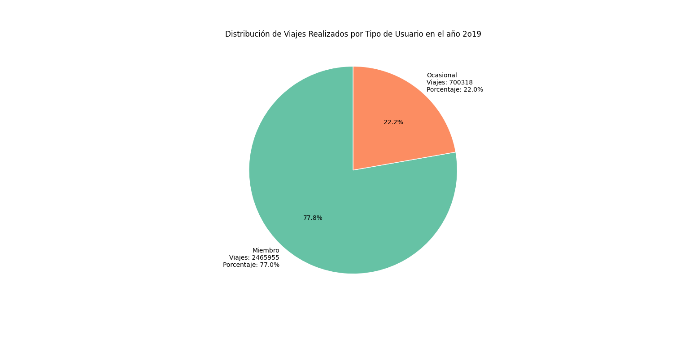
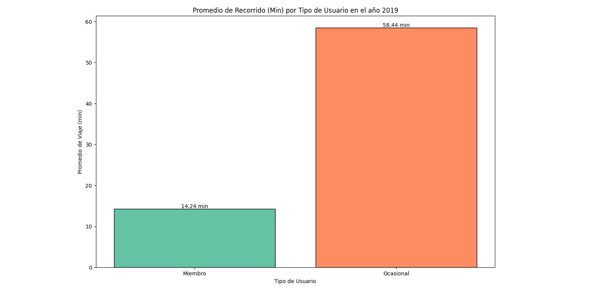
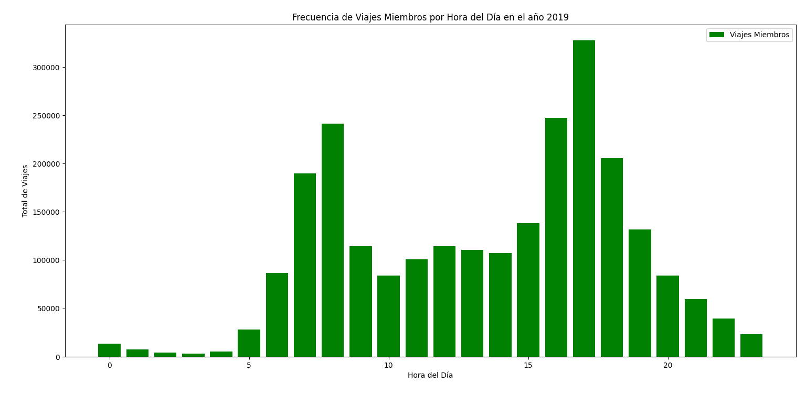
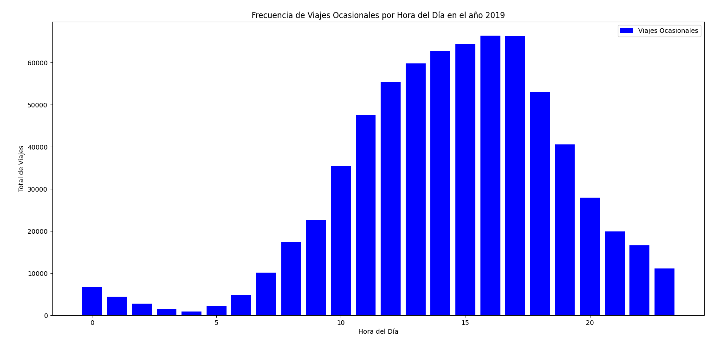
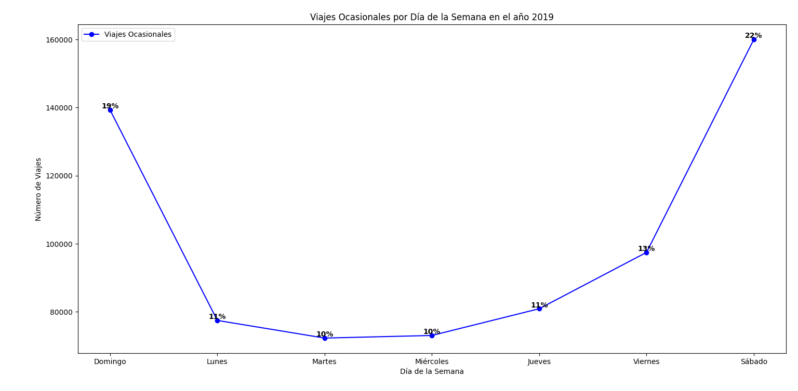
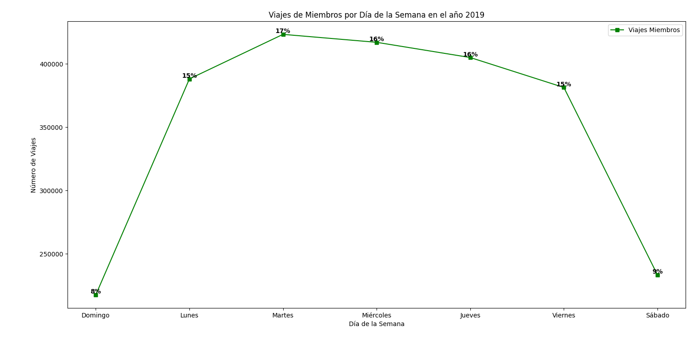
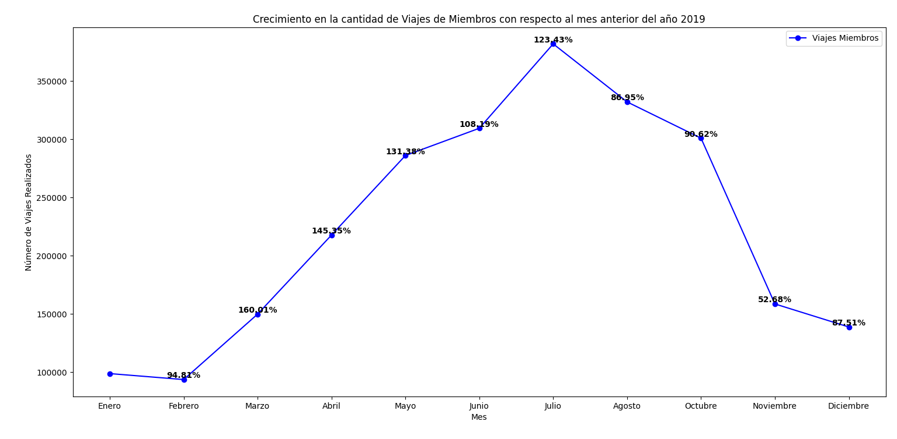
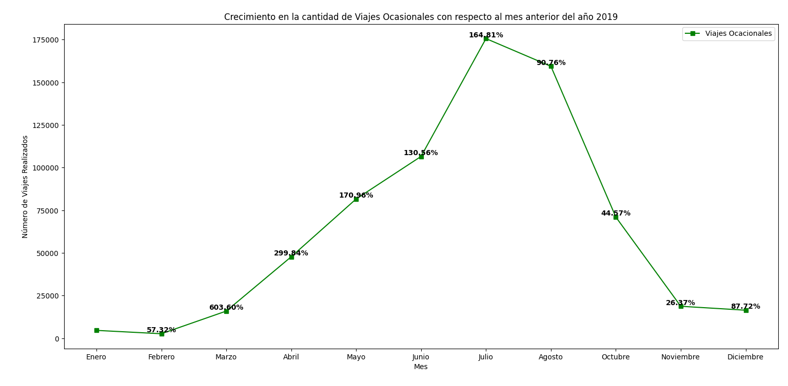
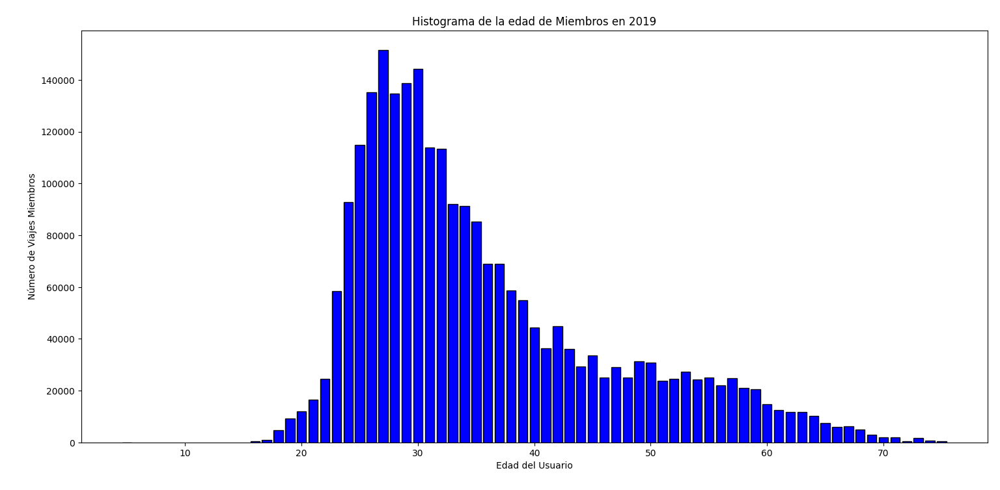
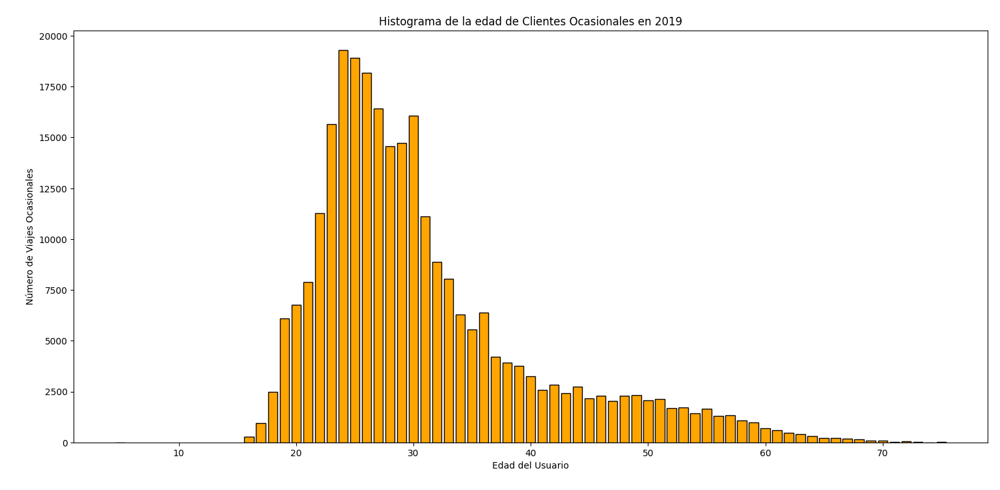

# Introducción

!Bienvenidos a un viaje fascinante a través de los datos de Cyclistics, donde las bicicletas no son medios de transporte sino de aventura¡ Descubriremos cuáles son las diferencias entre los Clientes Ocasionales y los Miembros, quienes utilizan los servicios de la empresa Cyclistics para movilizarse a cualquier punto de la ciudad.

¿Consultas SQL? Encuéntralas aquí: [Análisis_cyclistics](analisis_cyclistics)


# Antecedentes

Este proyecto se origina de un caso práctico del **Certificado profesional de Análisis de datos de Google** para desarrollar y aplicar mis conocimientos y habilidades adquiridas. Mi labor como analista de datos es utilizar mis conocimientos en la recolección y observación de los datos. Para después realizar el análisis de los datos históricos de viajes en bicicleta y presentar los resultados con gráficos y tablas. 

Cabe aclarar que Cyclistics es una empresa ficticia que se creó para este estudio de caso, así que los datos que recopilé provienen de [Motivate International Inc](https://divvy-tripdata.s3.amazonaws.com/index.html), quienes otorgaron la licencia para utilizar su base de datos.

Las preguntas que quería responder a través de mis consultas SQL fueron:
- ¿Cuántos viajes realizan los Clientes ocasionales y los Miembros?
- ¿Qué diferencias existen en la duración promedio de viajes?
- ¿Cuáles son los horarios pico para cada tipo de usuario?
- ¿Cuáles son las estaciones de salida más populares para cada usuario?
- ¿Existen patrones en los puntos de salida y llegada que difiere entre los clientes ocasionales y miembros?
- ¿En qué días de la semana los clientes ocasionales utilizan más el servicio frente a los miembros?
- ¿Como es el uso entre estaciones o temporada del año?
- ¿Qué patron de acumulacion y diferencia de mes con mes existe en cada tipo de usuario en los viajes realizados en 2019?
- ¿Cuál es la distribución de edad para cada cliente?

## Sobre la empresa
En 2016, Cyclistic lanzó una exitosa oferta de bicicletas compartidas. Desde entonces, el programa ha crecido hasta alcanzar una flota de 5.824 bicicletas que están geolocalizadas y bloqueadas en una red de 692 estaciones en todo Chicago. Las bicicletas se pueden desbloquear desde una estación y devolverse a cualquier otra estación del sistema en cualquier momento.

Hasta ahora, la estrategia de marketing de Cyclistic se basaba en generar conciencia general y atraer a amplios segmentos de consumidores. El enfoque que ayudó a hacer esto posible fue la flexibilidad de sus planes de precios: pases de viaje único, pases de día completo y membresías anuales. Los clientes que compran pases de un solo viaje o de un día completo se denominan Customer. Los clientes que compran membresías anuales son Subscriber de Cyclistic.

Los analistas financieros de Cyclistic han llegado a la conclusión de que los miembros anuales son mucho más rentables que los ciclistas ocasionales. Aunque la flexibilidad de precios ayuda a Cyclistic a atraer más clientes, Moreno (Directora de Marketing) cree que maximizar el número de miembros anuales será clave para el crecimiento futuro. En lugar de crear una campaña de marketing dirigida a clientes completamente nuevos, Moreno cree que existe una muy buena posibilidad de convertir a los pasajeros ocasionales en miembros. Ella señala que los ciclistas ocasionales ya conocen el programa Cyclistic y han elegido Cyclistic para sus necesidades de movilidad.

Moreno se ha fijado un objetivo claro: diseñar estrategias de marketing destinadas a convertir a los pasajeros ocasionales en miembros anuales. Sin embargo, para lograrlo, el equipo de analistas de marketing necesita comprender mejor cómo difieren los miembros anuales y los usuarios ocasionales. Moreno y su equipo están interesados en analizar los datos históricos de viajes en bicicleta para identificar tendencias.

# Herramientas que utilicé

Para conocer las diferencias entre los usuarios Customer y Subscriber, aproveché el poder de varias herramientas clave:

**Excel:**: Necesaria para la limpieza y la unificación de los datos de las cuatro tablas que corresponden a año 2019.

**SQL:** La columna vertebral de mi análisis, primero fue utilizada para unir las tablas y traducir algunos elementos, además, me permitió consultar la base de datos y descubrir ideas críticas.

**PostgreSQL:** El sistema de gestión de bases de datos elegido, ideal para manejar los datos de los viajes realizados.

**Visual Studio Code:** Mi herramienta principal para la gestión de bases de datos y la ejecución de consultas SQL.

**Python y Matplotlib:**: Útiles para la creación de visualizaciones que representen las consultas y los resultados obtenidos.

**Git y GitHub:** Esenciales para el control de versiones y compartir mis scripts y análisis SQL, asegurando la colaboración y el seguimiento del proyecto.

# El Análisis

Cada consulta para este proyecto tuvo como objetivo conocer las diferencias que hay entre los Clientes Ocasionales y Miembros que utilizaron el servicio en 2019.

## 1. El total de recorridos que realizaron durante el año 2019

Comenzamos a indentificar las diferencias entre los Clientes Ocasionales y los Miembros en la cantidad de viajes que realizaron durante el año. La base de datos venía en cuatro tablas, cada uno contenía la información trimestral de recorridos, así que decidí limpiarla y unificar todos los datos en una sola y utilizar esa tabla limpia durante todo el análisis. Cada fila es el registro de un recorrido que hizo un usuario, entonces, para conocer el total de viajes. Contabilicé las filas en la consulta y lo filtré por tipo de usuario. Después, dividí la cantidad de viajes por usuario por el total de viajes para obtener el porcentaje.

```sql
SELECT
    usertype AS Tipo_de_usuario,
    Count(*) AS viajes_realizados,
    (SELECT count(*) from viajes_2019) as total_de_viajes,
    Count(*)*100/(SELECT count(*) from viajes_2019) as porcentaje_del_total
FROM
    viajes_2019
GROUP BY 1;
```

Aquí tienes el desglose de la cantidad de recorridos que realizaron los usuarios en 2019:

***Total de recorridos***
- Los **Miembros** de Cyclistics son los principales usuarios del servicio. Realizan casi el 77% del total de viajes. 
Esto indica una alta tasa de adopción y un mayor compromiso con la marca por parte de los miembros.

- Los **Clientes Ocasionales**, a pesar de representar un porcentaje menor (22%), también contribuyen significativamente 
al total de viajes. Esto sugiere que Cyclistics tiene una base de clientes ocasionales sólida que podría convertirse 
en miembros potenciales.



*Gráfico de pastel que visualiza los recorridos totales por cada tipo de usuario y el porcentaje que representan del total; el gráfico se generó con Matplotlib a partir de los resultados de mi consulta SQL.*

## 2. El tiempo promedio de los recorridos que realizaron Clientes Ocasionales y Miembros en 2019

Para conocer el tiempo promedio de recorrido promedié la duración de cada viaje y lo agrupé por el tipo de usuario.

```sql
SELECT 
    usertype,
    Round(avg(trip_duration)/60,2) AS promedio_viaje_min
FROM viajes_2019
  GROUP BY 1;
```

Aquí tienes el desglose del promedio de recorrido de los usuarios que utilizaron el servicio de Cyclistics en 2019:

- Los **Miembros** realizan viajes más cortos y frecuentes: La menor duración promedio de los viajes sugiere que utilizan las bicicletas para desplazamientos más cortos, como ir al trabajo, hacer recados o realizar actividades recreativas cercanas.

- Los **Clientes Ocasionales** prefieren viajes más largos: La mayor duración promedio de los viajes podría indicar que los utilizan para explorar la ciudad, hacer turismo o realizar actividades de ocio que requieren más tiempo.

- ***Propósito del viaje***: Los **Miembros**, al tener una suscripción anual, pueden utilizar las bicicletas de forma más regular para desplazamientos diarios, mientras que los **Clientes Ocasionales** suelen alquilarlas para actividades específicas que requieren más tiempo.



*Gráfico de barras que visualiza el promedio de los recorridos realizados por cada tipo de usuario; el gráfico se generó con Matplotlib a partir de los resultados de mi consulta SQL.*

## 3. Las horas pico en los viajes realizados por cada tipo de usuario en 2019

La siguiente consulta busca conocer las horas donde es más utilizado el servicio, para ello se sumaron las filas que contuviera cada tipo de usuario (se filtró el tipo de usuario utilizando CASE). Luego se agruparon los resultados por hora del día y al final cada conteo se dividió por el total de viajes para conocer el porcentaje del total.

```sql
SELECT
    EXTRACT(hour From star_time_hora) as hora_del_dia,
    SUM(CASE WHEN usertype = 'Ocasional' THEN 1 ELSE 0 END) AS viajes_ocasionales,
    (SUM(CASE WHEN usertype = 'Ocasional' THEN 1 ELSE 0 END))*100/(SELECT count(*) FROM viajes_2019 WHERE usertype = 'Ocasional') as Porcentaje_ocasional,
    SUM(CASE WHEN usertype = 'Miembro' THEN 1 ELSE 0 END) AS viajes_miembros,
    (SUM(CASE WHEN usertype = 'Miembro' THEN 1 ELSE 0 END))*100/(SELECT count(*) FROM viajes_2019 WHERE usertype = 'Miembro') as Porcentaje_miembro
FROM viajes_2019
GROUP BY 1
ORDER BY 1 ASC;
```
Aquí tienes el desglose de las horas pico de los usuarios que utilizaron el servicio de Cyclistics en 2019:

- **Miembros:** Los horarios pico para parecen concentrarse entre las 6 AM y las 9 AM, y nuevamente entre las 16 PM y las 19 PM. Estos horarios coinciden con las horas punta de entrada y salida de los lugares de trabajo, lo que sugiere que muchos **Miembros** utilizan las bicicletas para sus desplazamientos diarios.

- **Clientes Ocasionales:** Los **Clientes Ocasionales** también presentan un pico en la mañana, pero este se extiende hasta el mediodía. Sin embargo, su pico más alto se encuentra entre las 12 PM y las 16 PM, lo que podría indicar que muchos de ellos utilizan las bicicletas para actividades de ocio o turismo durante el día.





*Gráficos de barras que visualiza las horas en donde se realizaron más recorridos durante el día; los gráficos se generaron con Matplotlib a partir de los resultados de mi consulta SQL.*

## 4. Estaciones que los Clientes Ocasionales y Miembros prefieren comenzar su recorrido en 2019

Explorar las estaciones donde los Clientes Ocasionales y Miembros partieron relevó los lugares donde los usuarios tiene una mayor preferencia de uso. Se realizaron dos consultas, uno para cada tipo de usuario.

```sql
--Top 10 estaciones de salida para Clientes ocasionales

SELECT
    from_station_name AS estación,
    count(*) as viajes_ocasionales
FROM viajes_2019
GROUP BY 1,usertype
HAVING usertype = 'Ocasional'
ORDER BY 2 DESC
LIMIT 10;
```

|Estación de partida|Viajes Ocasionaes|
|-|-|
|Streeter Dr & Grand Ave|41982|
|Lake Shore Dr & Monroe St|31986|
|Millennium Park|17068|
|Michigan Ave & Oak St|17006|
|Shedd Aquarium|16573|
|Lake Shore Dr & North Blvd|15367|
|Theater on the Lake|12022|
|Michigan Ave & Washington St|10444|
|Dusable Harbor|10178|
|Adler Planetarium|9681|

*Tabla con las 10 estaciones más utilizadas por los Clientes Ocasionales*

```sql
--Top 10 estaciones de salida para Miembros

SELECT
    from_station_name AS estación,
    count(*) As viajes_miembros
FROM viajes_2019
GROUP BY 1,usertype
HAVING usertype = 'Miembro'
ORDER BY 2 DESC
LIMIT 10;
```

|Estación de partida|Viajes miembros|
|-|-|-|
|Canal St & Adams St|43032|
|Clinton St & Washington Blvd|39036|
|Clinton St & Madison St|38925|
|Columbus Dr & Randolph St|27008|
|Kingsbury St & Kinzie St|26078|
|Franklin St & Monroe St|25945|
|Daley Center Plaza|25075|
|Canal St & Madison St|23305|
|Michigan Ave & Washington St|21373|
|LaSalle St & Jackson Blvd|19425|

*Tabla con las 10 estaciones más utilizadas por los usuarios Miembros*

Aquí tienes un desglose de los resultados para las estaciones que tiene mayor preferencia de partida de los Clientes Ocasionales y los Miembros en 2019:

- Los **Clientes Ocasionales** muestran una preferencia por estaciones ubicadas en zonas turísticas o con alta visibilidad, como:
    1. Frente al lago Michigan: Streeter Dr & Grand Ave, Lake Shore Dr & Monroe St, Lake Shore Dr & North Blvd, Shedd Aquarium, Theater on the Lake.
    2. Centros turísticos: Millennium Park, Michigan Ave & Oak St.
- Esta preferencia sugiere que los **Clientes Ocasionales** utilizan las bicicletas principalmente para fines recreativos o turísticos, explorando los lugares más emblemáticos de la ciudad.

- Por su parte, los **Miembros** muestran una preferencia por estaciones ubicadas en zonas más céntricas y con alta densidad de oficinas, como:
    1. Distrito financiero: Canal St & Adams St, Clinton St & Washington Blvd, Clinton St & Madison St, Columbus Dr & Randolph St, Franklin St & Monroe St, Daley Center Plaza, Canal St & Madison St, LaSalle St & Jackson Blvd.
    2. Esta preferencia indica que los **Miembros** utilizan las bicicletas principalmente para sus desplazamientos diarios, ya sea para ir al trabajo, hacer recados o realizar otras actividades en el centro de la ciudad.


## 5. Patrones en las rutas que realizan los Clientes Ocasionales y Miemebros en 2019

Explorar las rutas que realizaron cada tipo de usuario conociendo las estaciones de salida y de llegada que prefirieron, y así conocer su preferencia de uso. Conociendo la cantidad de viajes realizados y el tiempo promedio. Como en el punto anterior, se realizaron dos consultas, una para cada tipo de usuario.

```sql
---Top 10 rutas realizadas por Clientes Ocasionales

SELECT
    from_station_name || '-' || to_station_name AS ruta_viaje_ocasional,
    count(*) viajes_realizados,
    ROUND(avg(trip_duration/60),2) AS promedio_recorrido
FROM viajes_2019
GROUP BY usertype,from_station_name,to_station_name
HAVING usertype = 'Ocasional'
ORDER BY 2 DESC
LIMIT 10;
```
|Ruta realizada|Viajes Ocasionales|Tiempo promedio|
|-|-|-|
|Lake Shore Dr & Monroe St-Streeter Dr & Grand Ave|7583|31.16 min|
|Streeter Dr & Grand Ave-Streeter Dr & Grand Ave|6964|54.49 min|
|Lake Shore Dr & Monroe St-Lake Shore Dr & Monroe St|6723|46.34 min|
|Michigan Ave & Oak St-Michigan Ave & Oak St|3974|60.50 min|
|Shedd Aquarium-Streeter Dr & Grand Ave|2868|34.08 min|
|Streeter Dr & Grand Ave-Millennium Park|2436|35.28 min|
|Millennium Park-Millennium Park|2396|56.19 min|
|Streeter Dr & Grand Ave-Lake Shore Dr & Monroe St|2324|34.24 min|
|Millennium Park-Streeter Dr & Grand Ave|2254|46.14 min|
|Montrose Harbor-Montrose Harbor|2142|64.37 min|

*Tabla con las 10 rutas que prefirieron los Clientes Ocasionales*

```sql
---Top 10 rutas realizadas por Miembros

SELECT
    from_station_name || '-' || to_station_name AS ruta_viaje_miembro,
    count(*) viajes_realizados,
    ROUND(avg(trip_duration/60),2) AS promedio_recorrido
FROM viajes_2019
GROUP BY usertype,from_station_name,to_station_name
HAVING usertype = 'Miembro'
ORDER BY 2 DESC
LIMIT 10;
```
|Estación de llegada|Viajes Miembros|Tiempro promedio|
|-|-|-|
|Canal St & Adams St-Michigan Ave & Washington St|3004|9.01 min|
|Columbus Dr & Randolph St-Clinton St & Washington Blvd|2336|10.29 min|
|Michigan Ave & Washington St-Clinton St & Washington Blvd|2336|8.03 min|
|Michigan Ave & Washington St-Canal St & Adams St|2168|9.50 min|
|Canal St & Madison St-Michigan Ave & Washington St|2039|8.07 min|
|Clinton St & Washington Blvd-Michigan Ave & Washington St|1957|8.22 min|
|Columbus Dr & Randolph St-State St & Randolph St|1907|3.48 min|
|Wacker Dr & Washington St-Michigan Ave & Washington St|1860|6.32|
|Columbus Dr & Randolph St-Canal St & Adams St|1772|12.23|
|MLK Jr Dr & 29th St-State St & 33rd St|1679|7.39|

*Tabla con las 10 rutas que prefirieron los Miembros*

Al analizar los datos de las rutas más populares para cada tipo de usuario, podemos identificar los siguientes patrones:

- **Clientes Ocasionales:** Predominan las rutas que conectan puntos de interés turístico, como el lago Michigan y parques.
*Rutas circulares:* Muchos clientes ocasionales inician y terminan sus viajes en la misma estación, sugiriendo un uso recreativo o exploratorio de la ciudad.

- **Miembros:** Las rutas más populares conectan estaciones ubicadas en zonas comerciales y de oficinas, lo que indica que los miembros utilizan las bicicletas principalmente para sus desplazamientos diarios.
*Rutas cortas:* La mayoría de las rutas de los miembros son cortas, lo que sugiere que se utilizan para conectar diferentes 
puntos dentro de un área relativamente pequeña.

## 6. Los días de la semana que los Clientes Ocasionales y los Miembros prefieren viajar en 2019

La consulta contabilizó y sumó los recorridos si fueron realizados por Cliente Ocasional o Miembro. Después, filtó la información con los días para observar la tendencia de viajes en una semana.

```sql
SELECT
    día_semana,
    SUM(CASE WHEN usertype = 'Ocasional' THEN 1 ELSE 0 END) AS viajes_ocasionales,
    (SUM(CASE WHEN usertype = 'Ocasional' THEN 1 ELSE 0 END))*100/(SELECT count(*) FROM viajes_2019 WHERE usertype = 'Ocasional') as Porcentaje_ocasional,
    SUM(CASE WHEN usertype = 'Miembro' THEN 1 ELSE 0 END) AS viajes_miembros,
    (SUM(CASE WHEN usertype = 'Miembro' THEN 1 ELSE 0 END))*100/(SELECT count(*) FROM viajes_2019 WHERE usertype = 'Miembro') as Porcentaje_miembro
FROM viajes_2019
GROUP BY 1,weekday
ORDER BY weekday ASC;
```

Aquí tienes el desglose de los viajes y el promedio de tiempo que realizó cada usuario cada día de la semana:

- **Clientes Ocasionales:**
*Picos:* Domingo y Sábado.
*Menor uso:* Martes y Miércoles.
*Interpretación:* Los **Clientes Ocasionales** concentran su uso principalmente en fines de semana, lo que sugiere que utilizan el servicio para actividades recreativas o turísticas.

- **Miembros:**
*Uso más constante:* Los **Miembros** muestran un uso más distribuido a lo largo de la semana, sin picos tan marcados como los clientes ocasionales.
*Menor uso:* Domingo.
*Interpretación:* Los **Miembros** utilizan el servicio de manera más regular, probablemente para sus desplazamientos diarios.



*Gráfico lineal que representa los viajes que realizaron los Clientes Ocasionales por día de la semana; el gráfico se generó con Matplotlib a partir de los resultados de mi consulta SQL.*



*Gráfico lineal que muestra los viajes que realizaron los miembros por día de la semana; el gráfico se generó con Matplotlib a partir de los resultados de mi consulta SQL.*

## 7. Preferencias que tiene cada tipo de usuario para realizar viajes según las estaciones del año 2019 

En esta consulta primero se agruparon con CASE los meses para crear las estaciones del año, después se sumaron los recorridos si fueron realizados por Clientes Ocasionales o Mimebros. Al final, los viajes realizados en cada temporada se dividieron con el total general para obtener el procentaje.

```sql
SELECT
    CASE WHEN Month IN (12,1,2) THEN 'Invierno'
        WHEN Month IN (3,4,5) THEN 'Primavera'
        WHEN Month IN (6,7,8) THEN 'Verano'
        WHEN Month IN (9,10,11) THEN 'Otoño'
        END as Estación_del_año,
    SUM(CASE WHEN usertype = 'Ocasional' THEN 1 ELSE 0 END) AS viajes_ocasionales,
    (SUM(CASE WHEN usertype = 'Ocasional' THEN 1 ELSE 0 END))*100/(SELECT count(*) FROM viajes_2019 WHERE usertype = 'Ocasional') AS Porcentaje_ocasional,
    SUM(CASE WHEN usertype = 'Miembro' THEN 1 ELSE 0 END) AS viajes_miembros,
    (SUM(CASE WHEN usertype = 'Miembro' THEN 1 ELSE 0 END))*100/(SELECT count(*) FROM viajes_2019 WHERE usertype = 'Miembro') AS Porcentaje_miembro
FROM 
    viajes_2019
GROUP BY
    1;
```

Aquí tienes el desglose de los viajes que realizó cada usuario en cada estación del año 2019:

- **Invierno:** Tanto los **Clientes Ocasionales** como los **Miembros** muestran un uso significativamente menor durante el invierno. Esto puede deberse a condiciones climáticas adversas como frío, lluvia o nieve, que desalientan el uso de bicicletas.
- **Otoño:** Hay un ligero aumento en el uso comparado con el invierno, pero aún se encuentra por debajo de las otras estaciones.
- **Primavera:** Se observa un incremento considerable en el uso, tanto para **Clientes Ocasionales** como para **Miembros**. 
Esto podría deberse a la mejora de las condiciones climáticas y a la mayor disposición de las personas a realizar 
actividades al aire libre.
- **Verano:** Es la estación con mayor uso, tanto en términos absolutos como relativos. El buen clima y las vacaciones 
favorecen el uso de bicicletas para actividades recreativas y turismo.


*Gráfico de barras que representa los viajes que realizaron los dos tipos de usuario en cada estación del año; el gráfico se generó con Matplotlib a partir de los resultados de mi consulta SQL.*

## 8. Recorridos realizados mes con mes y el crecimiento mensual duarante el año 2019

El análisis del crecimiento de los recorridos realizados al mes con el mes anterior es interesante para ver el interés de los usuarios por el servicio, para ello, primero se realizó una subconsulta con los viajes de cada usuario al mes. Enseguida, utilizamos las funciones LAG y OVER para establecer el mes previo y sus recorridos y así conocer la diferencia y el porcentaje con el mes que analizamos. 

```sql
SELECT 
    tipo_usuario,
    mes,
    viajes_realizados,
    LAG(mes) OVER (PARTITION BY tipo_usuario ORDER BY mes) AS mes_previos,
    LAG(viajes_realizados) OVER (PARTITION BY tipo_usuario ORDER BY mes) AS recorridos_mes_previo,
    viajes_realizados - (LAG(viajes_realizados) OVER (PARTITION BY tipo_usuario ORDER BY mes)) AS diferencia,
    ROUND(viajes_realizados* 100.0 / (LAG(viajes_realizados) OVER (PARTITION BY tipo_usuario ORDER BY mes)),2) AS pct_crecimiento
FROM (
    SELECT 
            usertype AS tipo_usuario,
            EXTRACT(month FROM star_time_fecha) AS mes,
            COUNT(*) AS viajes_realizados
        FROM viajes_2019
        GROUP BY usertype, EXTRACT(month FROM star_time_fecha));
```
Aquí tienes el desglose del crecimiento mensual de los viajes que realizó cada usuario durante 2019:

- **Patrones Generales:** Existe una tendencia alcista, tanto miembros como usuarios ocasionales muestran una tendencia general 
al alza en el número de viajes a lo largo del año, con algunas excepciones.
- **Estacionalidad:** Se observa una clara estacionalidad, con un pico en los meses de verano (junio, julio y agosto) y una disminución significativa en los meses de invierno (enero, febrero y diciembre).
- **Fluctuaciones:** Existen fluctuaciones significativas de un mes a otro, especialmente en los usuarios ocasionales.

Análisis por Tipo de Usuario:

- **Miembros:** Los **Miembros** muestran un crecimiento más consistente a lo largo del año, con algunas pequeñas disminuciones en los meses de invierno. El crecimiento porcentual entre meses es relativamente estable, lo que sugiere un uso más regular del servicio.

- **Clientes Ocasionales:** Los **Clientes Ocasionales** muestran una mayor variabilidad en el número de viajes de un mes a otro. Los picos de uso se concentran en los meses de verano, coincidiendo con las vacaciones y el buen 
tiempo.



*Gráfico lineal que representa los viajes mensuales y el crecimiento mensual de los Miembtos en 2019; el gráfico se generó con Matplotlib a partir de los resultados de mi consulta SQL.*



*Gráfico lineal que representa los viajes mensuales y el crecimiento mensual de los Clientes Ocasionales en 2019; el gráfico se generó con Matplotlib a partir de los resultados de mi consulta SQL.*

## 9. Edad de los usuarios que realizaron viajes en 2019

La última consulta analiza la frecuencia de viajes realizados por cada tipo de usuario según su edad, primero se restó su fecha de nacimiento con el año del análisis y después se sumaron los viajes que realizaron los Clientes Ocasionales y Miembros. Al final se agruparon los datos bajo el parámetro de edad.

```sql
SELECT
    2019-birthyear AS edad_del_usuario,
    SUM(CASE WHEN usertype = 'Ocasional' THEN 1 ELSE 0 END) AS viajes_ocasionales,
    SUM(CASE WHEN usertype = 'Miembro' THEN 1 ELSE 0 END) AS viajes_miembros
FROM
    viajes_2019
WHERE
    birthyear IS NOT NULL AND
    birthyear > 1943
GROUP BY
    birthyear
ORDER BY 1 ASc;
```
Aquí tienes el desglose de los viajes realizados por la edad de cada usuario en 2019:
- **Concentración en jóvenes:** La mayoría de los viajes son realizados por personas entre 18 y 35 años, tanto para **Clientes Ocasionales** como para **Miembros**.
- **Declinación gradual:** A medida que aumenta la edad, el número de viajes tiende a disminuir.
- **Diferencias entre tipos de usuarios:** Aunque ambos grupos muestran una tendencia similar, los **Miembros** tienen el pico en la edad de 30 años a diferencia de los **Clientes Ocasionales** que el pico se encuentra en los 24 años.



*Histograma que representa los viajes de los Miembtos según su edad en 2019; el gráfico se generó con Matplotlib a partir de los resultados de mi consulta SQL.*



*Histograma que representa los viajes de los Clientes Ocasionales según su edad en 2019; el gráfico se generó con Matplotlib a partir de los resultados de mi consulta SQL.*

# Lo que apredí
A lo largo del proyecto reafimé mis habilidades aprendidas en el curso, los pasos que se deben realizar en el análisis de datos: como plantear las preguntas, limpiar los datos, analizar los datos y crear las visualizaciones pertinentes. En cuanto a las herramientas reforcé mis conocimentos en:

🧩 Creación de Consultas Complejas en SQL: Dominé el arte del SQL avanzado, utilizando subconsultas, funciones como CASE para filtrar si el dato se refiere a un Cliente Ocasional o un Miembro o para crear una columna de Estación del año a partir de los meses, también utilicé las funciones LAG y OVER para mostrar el crecimiento en los viajes realizados mes con mes. Y también funciones de agregación como COUNT(), AVG(), y SUM().

📊 Limpieza de datos en Excel y SQL: Utilicé los filtros para eliminar datos nulos o erróneos, unifiqué el formato de los datos como la fecha y la hora, utilicé fórmulas como resta para obtener el tiempo de los recorridos y las funciones =MES y =DIASEM para obtener el día de la semana y el mes en Excel. En SQL unifiqué las cuatro tablas en una sola y traduje algunas palabras como el tipo de usuario y el género. 

💡 Magia Analítica: Mejoré mis habilidades de resolución de problemas del mundo real, convirtiendo preguntas en consultas SQL accionables y perspicaces.

# Conclusión
## Insights

Del análisis, surgieron varios Insights para establecer las diferencias entre Clientes Ocasionales y Miembros:
- En cuanto a los viajes totales y al tiempo promedio de recorrido,los Miembros son los que realizaron una mayor cantidad de viajes con el 78% de los recorridos mientras los Clientes Ocasionales realizaron solo el 22%. Los viajes de los Clientes Ocasionales son más largos ya que en promedio cada viaje tiene una duración de 58.44 min, a diferencia de los Clientes Ocasionales que cada recorrido dura en promedio 14.26 min. Lo que significa que los Miembros utilizan el servicio de Cyclistics para traslados diarios y cortos, mientras los Clientes Ocasionales prefieren realizar paseos más largos y ocasionales.

- Otra diferencia se encuentra en el uso diario del servicio y en las horas pico de los viajes. Los Clientes Ocasionales prefieren los fines de semana para utilizar las bicicletas ya que esos días son los más altos en la cantidad de viajes. Además, durante el día, la mañana y el medio día es su horario de preferencia. Los Miembros suelen viajar más en días hábiles para dirigirse a su trabajo o realizar viajes cortos y eso se muestra en la preferencia hacia los días y horarios laborables (Lunes a Viernes de 7 a 9 am y de 5 a 7 pm).

- Los usuarios hombres realizaron más recorridos que las mujeres en los dos tipos de usuarios. De igual forma, en ambos usuarios los recorridos se concentraron en edades de los 20 a los 40 años. 

- La principal diferencia entre los usuarios Customer y Subscriber es el uso que le da al servicio de Cyclistics. Los primeros suelen utilizarlas en día de descanso para recreación y paseo, es por ello que los recorridos son pocos y el tiempo mayor. Los usuarios Subscriber utilizan el servicio para recorridos cortos y en días laborales, lo que significa que se movilizan a su lugar de trabajo o para realizar mandados rápidos.

- La siguiente diferencia está en las rutas, los Miembros suelen realizar rutas más cortas y directas, conectando principalmente zonas de trabajo y residenciales. Los Clientes Ocasionales, por su parte, prefieren rutas más largas y exploratorias, a menudo en zonas turísticas e incluso salen y regresan de la misma estación.

- La última diferencia que hay en los patrones de uso en el servicio de Cyclistics es en la edad, aunque no es muy notoria como los demas, la mayor cantidad de recorridos que realizaron los Miembros fueron hecho pos adultos de 27 a 30 añ0s, en cambio, los Clientes Ocasionales fueron adultos de 24 a 27 años.

- El clima afecta el uso del servicio, ya que los meses más cálidos son donde se concentraron la mayor cantidad de recorridos y en la temporada de otoño e invierno se reduce drásticamente, eso afecta al crecimiento mensual de los viajes sin importar el tipo de usuario.

- Como conclusión, la principal diferencia que existe entre Miembros y Clientes Ocasionales es el motivo de uso, los primeros prefieren realizar recorridos cortos para trasladarse a su trabajo mientras los segundo prefieren utilizar el servicio como ocio.

- En cuanto la estrategia de Marketing funcionaria realizar eventos como paseo o recorridos casuales para presentar las ventajas que significaria obtener la mebresia anual y también colocar anuncios publicitarios en las zonas que son más utilizadas por los Clientes Ocasionales, además de presentar las ventajas de obtener una suscripción para utilizar de forma constante la bicicleta y no verla como una herramienta de entretenimiento sino como un medio de transporte en la ciudad.

# Reflexiones Finales
Este proyecto lo desarrollé para mejorar mis habilidades en las herramientas de análisis de datos como Excel y SQL para proporcionar valiosas ideas sobre las diferencias entre los Clientes Ocasionales y Miembros. Los hallazgos servirán como guía a la empresa Cyclistics para conocer los patrones que hay entre sus usuarios y sus diferencias y así crear las campañas pertinentes para seguir creciendo y obtener una mayor cantidad de Miembros.


