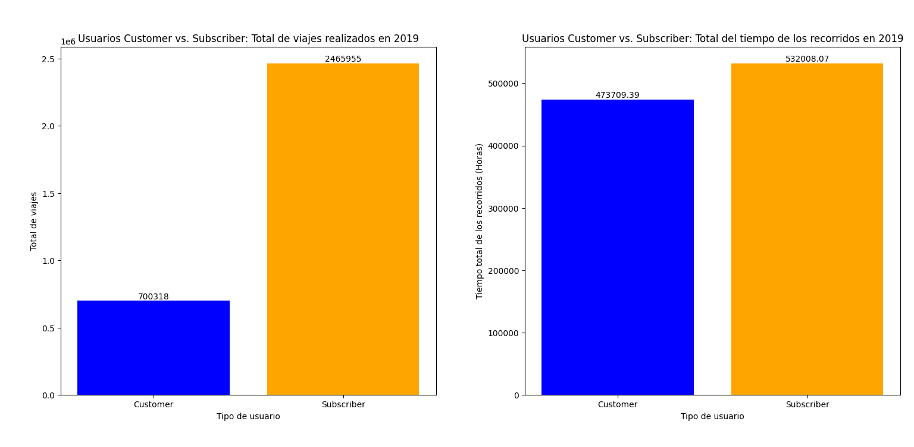
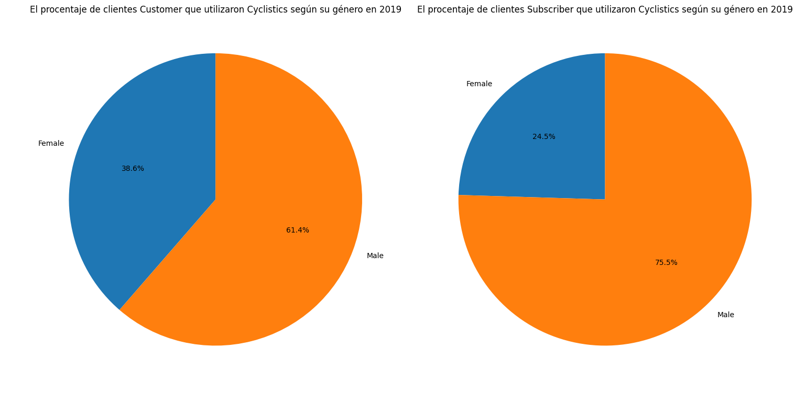
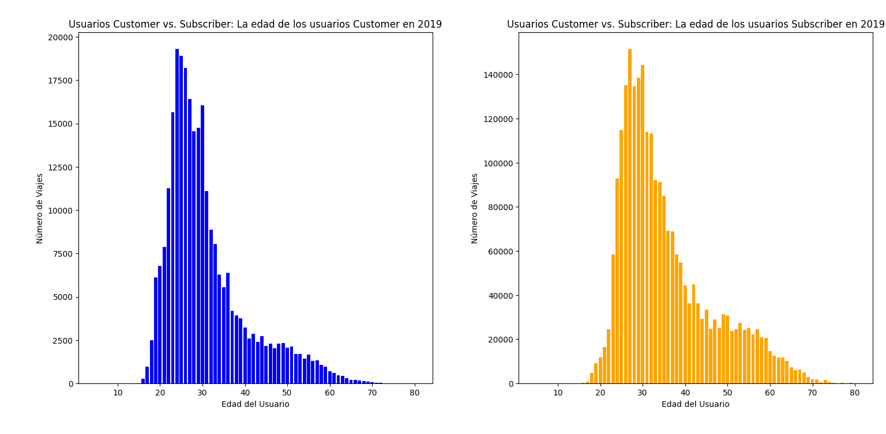
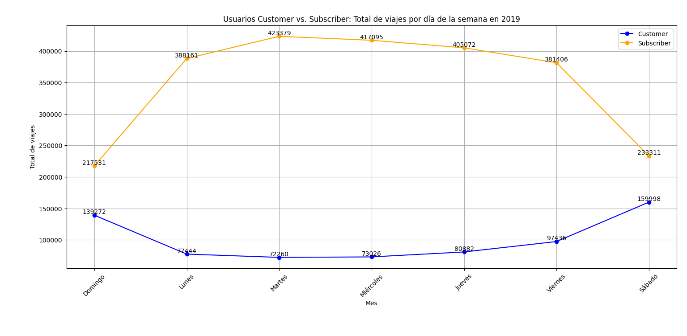
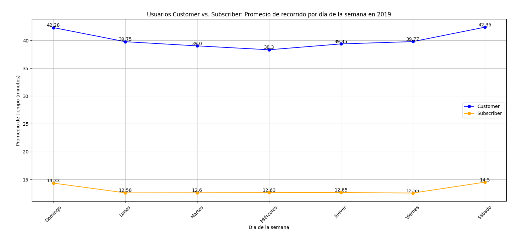
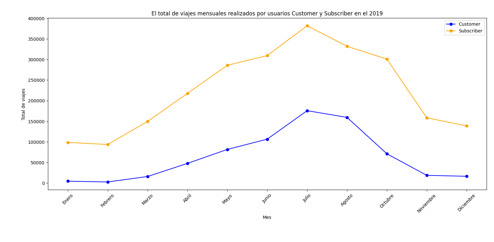

# Introducción

!Bienvenidos a un viaje fascinante a través de los datos de Cyclistics, donde las bicicletas no son medios de transporte sino de aventura¡ Descubriremos cuáles son las diferencias entre los usuarios Customer y Subscriber, quienes utilizan los servicios de la empresa Cyclistics para movilizarse a cualquier punto de la ciudad.

¿Consultas SQL? Encuéntralas aquí: [Análisis_cyclistics](analisis_cyclistics)


# Antecedentes

Este proyecto se origina de un caso práctico del **Certificado profesional de Análisis de datos de Google** para desarrollar y aplicar mis conocimientos y habilidades adquiridas. Mi labor como analista de datos es utilizar mis conocimientos en la recolección y observación de los datos. Para después realizar el análisis de los datos históricos de viajes en bicicleta y presentar los resultados con gráficos y tablas. 

Cabe aclarar que Cyclistics es una empresa ficticia que se creó para este estudio de caso, así que los datos que recopilé provienen de [Motivate International Inc](https://divvy-tripdata.s3.amazonaws.com/index.html), quienes otorgaron la licencia para utilizar su base de datos.

Las preguntas que quería responder a través de mis consultas SQL fueron:
- ¿Cuál es la diferencia entre los usuarios Subscriber y Customer en la cantidad de viajes y el total del tiempo recorrido?
- ¿Cuál es el género de los usuarios Subscriber y Customer?
- ¿Cuál es la edad de los usuarios Subsciber y Customer?
- ¿Cuál es la diferencia entre los usuarios Subscriber y Customer en el total de viajes realizados por día de la semana?
- ¿Cuál es la diferencia entre los usuarios Subscriber y Customer en el total de viajes realizados por mes durante el 2019?
- ¿Cuál es la diferencia entre los usuarios Subscriber y Customer de acuerdo a la estación que parten su recorrido?
- ¿Cuál es la diferencia entre los usuarios Subscriber y Customer de acuerdo a la estación que concluyen su recorrido?

## Sobre la empresa
En 2016, Cyclistic lanzó una exitosa oferta de bicicletas compartidas. Desde entonces, el programa ha crecido hasta alcanzar una flota de 5.824 bicicletas que están geolocalizadas y bloqueadas en una red de 692 estaciones en todo Chicago. Las bicicletas se pueden desbloquear desde una estación y devolverse a cualquier otra estación del sistema en cualquier momento.

Hasta ahora, la estrategia de marketing de Cyclistic se basaba en generar conciencia general y atraer a amplios segmentos de consumidores. El enfoque que ayudó a hacer esto posible fue la flexibilidad de sus planes de precios: pases de viaje único, pases de día completo y membresías anuales. Los clientes que compran pases de un solo viaje o de un día completo se denominan Customer. Los clientes que compran membresías anuales son Subscriber de Cyclistic.

Los analistas financieros de Cyclistic han llegado a la conclusión de que los miembros anuales son mucho más rentables que los ciclistas ocasionales. Aunque la flexibilidad de precios ayuda a Cyclistic a atraer más clientes, Moreno (Directora de Marketing) cree que maximizar el número de miembros anuales será clave para el crecimiento futuro. En lugar de crear una campaña de marketing dirigida a clientes completamente nuevos, Moreno cree que existe una muy buena posibilidad de convertir a los pasajeros ocasionales en miembros. Ella señala que los ciclistas ocasionales ya conocen el programa Cyclistic y han elegido Cyclistic para sus necesidades de movilidad.

Moreno se ha fijado un objetivo claro: diseñar estrategias de marketing destinadas a convertir a los pasajeros ocasionales en miembros anuales. Sin embargo, para lograrlo, el equipo de analistas de marketing necesita comprender mejor cómo difieren los miembros anuales y los usuarios ocasionales. Moreno y su equipo están interesados en analizar los datos históricos de viajes en bicicleta para identificar tendencias.

# Herramientas que utilicé

Para conocer las diferencias entre los usuarios Customer y Subscriber, aproveché el poder de varias herramientas clave:

**Excel:**: Necesaria para la limpieza y la unificación de los datos de las cuatro tablas que corresponden a año 2019.
**SQL:** La columna vertebral de mi análisis, que me permitió consultar la base de datos y descubrir ideas críticas.
**PostgreSQL:** El sistema de gestión de bases de datos elegido, ideal para manejar los datos de los viajes realizados.
**Visual Studio Code:** Mi herramienta principal para la gestión de bases de datos y la ejecución de consultas SQL.
**Python y Matplotlib:**: Útiles para la creación de visualizaciones que representen las consultas y los resultados obtenidos.
**Git y GitHub:** Esenciales para el control de versiones y compartir mis scripts y análisis SQL, asegurando la colaboración y el seguimiento del proyecto.

# El Análisis

Cada consulta para este proyecto tuvo como objetivo conocer las diferencias que hay entre los usuarios Customer y Subscriber que utilizaron el servicio en 2019.

## 1. La cantidad de recorridos y el tiempo total que realizaron los Customer y los Subscriber

Para identificar las diferencias en la cantidad de recorridos y el tiempo total de los mismos durante el año 2019 unifiqué las cuatro tablas trimestrales (la misma tabla será utilizada en todas las búsquedas) y filtré la información por tipo de usuario. Esta consulta contabiliza la cantidad de recorridos realizados y suma el tiempo de cada recorrido.

```sql
WITH viajes_2019_anual AS (
SELECT * FROM viajes_2019_ene_mar
UNION ALL
SELECT * FROM viajes_2019_abr_jun
UNION ALL
SELECT * FROM viajes_2019_jul_sep
UNION ALL
SELECT * FROM viajes_2019_oct_dic
)

SELECT
    usertype,
    COUNT(*) As viajes_totales,
    SUM(ride_length) AS tiempo_total_recorridos
FROM 
    viajes_2019_anual
GROUP BY
    usertype;
```

Aquí tienes el desglose de la cantidad de recorridos y el tiempo total que realizaron los usuarios en 2019:

***Total de recorridos***
- **Los Subscribers** tienen una cantidad significativamente mayor de viajes con un total de 2,465,955 viajes durante 2019.
- **Los Customers** realizaron 700,318 viajes en el mismo período analizado.
- Esta diferencia sugiere que los **Subscribers** son usuarios más frecuentes del servicio de bicicletas en comparación con los **Customers**.

***Total del Tiempo Recorrido***
- **Los Subscribers** acumularon 532,008 horas de tiempo recorrido.
- **Los Customers** acumularon un total de 473,709 horas de tiempo recorrido
- A pesar de realizar menos viajes en total, los **Customers** pasan más tiempo en promedio utilizando el servicio de bicicletas en comparación con los **Subscribers**.



*Gráfico de barras que visualiza los recorridos totales y el tiempo total de los recorridos que realizaron los dos tipos usuarios; el gráfico se generó con Matplotlib a partir de los resultados de mi consulta SQL.*

## 2. El género de los usuarios Customer y Subscriber

Para conocer el género de cada tipo de usuario utilicé la tabla de viajes anuales, sumé los recorridos realizados dependiendo si el usuario es Customer y Subscriber y al final filtrar la consulta por el género, para analizar el género de cada usuario que utilizó el servicio.

```sql
WITH viajes_2019_anual AS (
SELECT * FROM viajes_2019_ene_mar
UNION ALL
SELECT * FROM viajes_2019_abr_jun
UNION ALL
SELECT * FROM viajes_2019_jul_sep
UNION ALL
SELECT * FROM viajes_2019_oct_dic
)

SELECT
    gender,
    SUM(CASE WHEN usertype = 'Customer' THEN 1 ELSE 0 END) AS viajes_customer,
    SUM(CASE WHEN usertype = 'Subscriber' THEN 1 ELSE 0 END) AS viajes_subscriber
FROM
    viajes_2019_anual
WHERE
    gender IS NOT NULL
GROUP BY
    gender;
```

Aquí tienes el desglose del género de los usuarios que utilizaron el servicio de Cyclistics en 2019:

- Tanto para **Customers** como para **Subscribers**, los **hombres** realizan una cantidad significativamente 
mayor de viajes en comparación con las **mujeres**.
- Los **hombres** tienen un total de 1,847,245 viajes (75.3%) como **Subscribers**, mientras que las **mujeres** tienen solo 599,795 viajes (24.5%).
- Del mismo modo, los **hombres** tienen 164,712 viajes (61.6%) como **Customers**, mientras que las **mujeres** tienen 103,695 viajes (38.6%).
- Esta diferencia puede estar influenciada por diversos factores, como las preferencias de transporte, 
la ubicación geográfica, la seguridad percibida y las actividades recreativas.



*Gráfico de barras que visualiza el porcentaje de usuarios que utilizaron el servicio según su género; el gráfico se generó con Matplotlib a partir de los resultados de mi consulta SQL.*

## 3. La edad de los usuarios Customer y Subscriber

La siguiente consulta retoma el código anterior y organiza los resultados con base en la fecha de nacimiento de cada usuario que utilizó el servicio. Después resta el año de nacimiento con la fecha de registo para obtener la edad y 
filtra la fecha de nacimiento a partir de año 1938.

```sql
WITH viajes_2019_anual AS (
SELECT * FROM viajes_2019_ene_mar
UNION ALL
SELECT * FROM viajes_2019_abr_jun
UNION ALL
SELECT * FROM viajes_2019_jul_sep
UNION ALL
SELECT * FROM viajes_2019_oct_dic
)

SELECT
    2019-birthyear AS edad_del_usuario,
    SUM(CASE WHEN usertype = 'Customer' THEN 1 ELSE 0 END) AS viajes_customer,
    SUM(CASE WHEN usertype = 'Subscriber' THEN 1 ELSE 0 END) AS viajes_subscriber
FROM
    viajes_2019_anual
WHERE
    birthyear IS NOT NULL AND
    birthyear > 1938
GROUP BY
    birthyear;
```
Aquí tienes el desglose de la edad de los usuarios que utilizaron el servicio de Cyclistics en 2019:

- Se observa un patrón en el que la cantidad de viajes disminuye a medida que aumenta la edad, tanto para **Customers** como para **Subscribers**.
- Los usuarios más **jóvenes**, entre 16 y 30 años, tienden a realizar una mayor cantidad de viajes en comparación con los usuarios de **mayor edad**.
- Los datos sugieren que el servicio de bicicletas puede ser más atractivo para los usuarios más **jóvenes**, quienes tienden a ser más activos en términos de viajes y podría atribuirse a la población activa y en edad laboral que utiliza el servicio como medio de transporte alternativo.



*Gráfico de barras que visualiza la edad de los usuarios que utilizaron el servicio según su edad; el gráfico se generó con Matplotlib a partir de los resultados de mi consulta SQL.*

## 4. El promedio de tiempo y los recorridos que realizaron los dos tipos de usuarios por semana

La consulta contabilizó los recorridos si fueron realizados por Customer o Subscriber, del mismo modo promedió el tiempo si el usuario fue alguno de los dos tipos. Después filtó la información con los días para observar la tendencia de viajes en una semana.

```sql
WITH viajes_2019_anual AS (
SELECT * FROM viajes_2019_ene_mar
UNION ALL
SELECT * FROM viajes_2019_abr_jun
UNION ALL
SELECT * FROM viajes_2019_jul_sep
UNION ALL
SELECT * FROM viajes_2019_oct_dic
)

SELECT
    weekday,
    AVG( CASE WHEN usertype = 'Customer' THEN ride_length ELSE NULL END) AS promedio_recorrido_customer,
    AVG( CASE WHEN usertype = 'Subscriber' THEN ride_length ELSE NULL END) AS promedio_recorrido_subscriber,
    SUM(CASE WHEN usertype = 'Customer' THEN 1 ELSE 0 END) AS total_viajes_customer,
    SUM(CASE WHEN usertype = 'Subscriber' THEN 1 ELSE 0 END) AS total_viajes_subscriber
FROM 
    viajes_2019_anual
GROUP BY
    weekday;

```

Aquí tienes el desglose de los viajes y el promedio de tiempo que realizó cada usuario cada día de la semana:

- Los **Subscribers** tienden a tener una mayor cantidad de recorrido pero su promedio de tiempo es más corto en comparación con los **Customers** en todos los días de la semana.
- El día con la mayor diferencia en el tiempo promedio de recorrido y la cantidad de viajes entre **Subscribers** y **Customers** son los **fines de semana** (Día 7 y 1), 
- Los **Subscribers** realizan más recorridos en bicicleta en en los días laborables (Días 2-6).



*Gráfico lineal que representa los viajes que realizaron los dos tipos de usuario por día de la semana; el gráfico se generó con Matplotlib a partir de los resultados de mi consulta SQL.*




*Gráfico lineal que muestra el promedio de tiempo en los recorridos de los dos tipos de usuarios por día de la semana; el gráfico se generó con Matplotlib a partir de los resultados de mi consulta SQL.*

## 5. Recorridos que realizaron los dos tipos de usuarios por mes

En esta consulta solo se contabilizaron los recorridos si fueron realizados por Customer o Subscriber y el conteo se filtró por mes del año.

```sql
WITH viajes_2019_anual AS (
SELECT * FROM viajes_2019_ene_mar
UNION ALL
SELECT * FROM viajes_2019_abr_jun
UNION ALL
SELECT * FROM viajes_2019_jul_sep
UNION ALL
SELECT * FROM viajes_2019_oct_dic
)

SELECT
    Month,
    SUM(CASE WHEN usertype = 'Customer' THEN 1 ELSE 0 END) AS total_viajes_customer,
    SUM(CASE WHEN usertype = 'Subscriber' THEN 1 ELSE 0 END) AS total_viajes_subscriber
FROM 
    viajes_2019_anual
GROUP BY
    Month;
```

Aquí tienes el desglose de los viajes que realizó cada usuario en cada mes durante 2019:

- Los **Subscribers** muestran consistentemente un total de recorridos más alto que los **Customers** en todos los meses del año.
- En los meses con mayor actividad, como **junio, julio y agosto**, la brecha entre **Subscribers** y **Customers** es más notable, con una diferencia significativa en el total de recorridos.
- Los **Subscribers** tienden a utilizar el servicio de bicicletas de manera más frecuente y constante a lo largo del año.
- Los **Customers** muestran fluctuaciones en su uso del servicio a lo largo del año, con picos de actividad en los meses de mayor clima cálido, como **mayo, junio, julio y agosto**.
- La actividad de los **Customers** parece estar más influenciada por las estaciones y el clima, con un aumento en los meses más cálidos y una disminución en los meses más fríos.



*Gráfico lineal que representa los viajes que realizaron los dos tipos de usuario por mes del año; el gráfico se generó con Matplotlib a partir de los resultados de mi consulta SQL.*

## 6. Estaciones que los usuarios Customer y Subscriber prefieren comenzar su recorrido

Explorar las estaciones donde los usuarios Customer y Subcriber partieron relevó los lugares donde los usuarios tiene una mayor preferencia de uso.

```sql
WITH viajes_2019_anual AS (
SELECT * FROM viajes_2019_ene_mar
UNION ALL
SELECT * FROM viajes_2019_abr_jun
UNION ALL
SELECT * FROM viajes_2019_jul_sep
UNION ALL
SELECT * FROM viajes_2019_oct_dic
)

SELECT
    from_station_name,
    SUM(CASE WHEN usertype = 'Customer' THEN 1 ELSE 0 END) AS total_viajes_customer,
    SUM(CASE WHEN usertype = 'Subscriber' THEN 1 ELSE 0 END) AS total_viajes_subscriber
FROM 
    viajes_2019_anual
GROUP BY
    from_station_name
ORDER BY
    SUM(CASE WHEN usertype = 'Customer' THEN 1 ELSE 0 END) DESC
LIMIT 15;
```
|Estación de partida|Viajes realizados por Customer|Viajes realizados por Subscriber|
|-|-|-|
|Streeter Dr & Grand Ave|41982|12095|
|Lake Shore Dr & Monroe St|31986|8718|
|Millennium Park|17068|10159|
|Michigan Ave & Oak St|17006|11508|
|Shedd Aquarium|16573|4799|
|Lake Shore Dr & North Blvd|15367|12561|
|Theater on the Lake|12022|13926|
|Michigan Ave & Washington St|10444|21373|
|Dusable Harbor|10178|3850|
|Adler Planetarium|9681|4009|

*Tabla con las 10 estaciones más utilizadas por los usuarios Customer*

Aquí tienes un desglose de los resultados para las estaciones que tiene mayor preferencia de partida de los usuarios Customer en 2019:

- Se observa que hay diferencias significativas en la cantidad de viajes realizados por Customers y Subscribers desde diferentes estaciones de partida.
- Algunas estaciones, como **"Streeter Dr & Grand Ave" y "Lake Shore Dr & Monroe St"**, muestran una mayor cantidad de viajes realizados por **Customers**.
- Las estaciones como **"Columbus Dr & Randolph St" y "Michigan Ave & Washington St"** registran una cantidad significativamente mayor de viajes realizados por **Subscribers**.

## 7. Estaciones que los usuarios Customer prefieren concluir su recorrido

Explorar las estaciones donde los usuarios Customer y Subcriber concluyeron su recorrido relevó los lugares donde los usuarios tiene una mayor preferencia de uso.

```sql
WITH viajes_2019_anual AS (
SELECT * FROM viajes_2019_ene_mar
UNION ALL
SELECT * FROM viajes_2019_abr_jun
UNION ALL
SELECT * FROM viajes_2019_jul_sep
UNION ALL
SELECT * FROM viajes_2019_oct_dic
)

SELECT
    to_station_name,
    SUM(CASE WHEN usertype = 'Customer' THEN 1 ELSE 0 END) AS total_viajes_customer,
    SUM(CASE WHEN usertype = 'Subscriber' THEN 1 ELSE 0 END) AS total_viajes_subscriber
FROM 
    viajes_2019_anual
GROUP BY
    to_station_name
ORDER BY
    SUM(CASE WHEN usertype = 'Customer' THEN 1 ELSE 0 END) DESC
LIMIT 15;
```
|Estación de llegada|Viajes realizados por Customer|Viajes realizados por Subscriber|
|-|-|-|
|Streeter Dr & Grand Ave|53797|11499|
|Lake Shore Dr & Monroe St|25218|8267|
|Millennium Park|19972|10125|
|Michigan Ave & Oak St|18830|11629|
|Lake Shore Dr & North Blvd|18809|15261|
|Theater on the Lake|15238|14127|
|Shedd Aquarium|13280|4738|
|Michigan Ave & Washington St|10468|23931|
|Adler Planetarium|8652|4002|
|Dusable Harbor|7782|3956|

*Tabla con las 10 estaciones más utilizadas por los usuarios Customer*

Aquí tienes un desglose de los resultados para las estaciones que tiene mayor preferencia de llegada de los usuarios Customer en 2019:

- Se observa que hay diferencias significativas en la cantidad de viajes realizados por **Customers y Subscribers** hacia diferentes estaciones de llegada.
- Algunas estaciones, como **"Streeter Dr & Grand Ave" y "Lake Shore Dr & Monroe St"**, registran una mayor cantidad de viajes realizados por **Customers**.
- Por otro lado, estaciones como **"Michigan Ave & Washington St" y "Lake Shore Dr & North Blvd"** muestran una cantidad 
significativamente mayor de viajes realizados por **Subscribers**.
- Algunas estaciones pueden ser más populares entre los **Subscribers** debido a su ubicación estratégica o a la disponibilidad de rutas preferidas.
- Las estaciones destino que prefieren los usuarios **Customer** están ubicadon en lugares turísticos o de recreación.

# Lo que apredí
A lo largo del proyecto reafimé mis habilidades aprendidas en el curso, los pasos que se deben realizar en el análisis de datos: como plantear las preguntas, limpiar los datos, analizar los datos y crear las visualizaciones pertinentes. En cuanto a las herramientas reforcé mis conocimentos en:

🧩 Creación de Consultas Complejas en SQL: Dominé el arte del SQL avanzado, utilizando cláusulas WITH para manejar tablas temporales, la expresión CASE para filtar las columnas dependiendo si el dato es sobre el usuario Customer o Subscriber y las funciones de agregación como COUNT(), AVG(), y SUM().
📊 Limpieza de datos en Excel: Utilicé los filtros para eliminar datos nulos o erróneos, unifiqué el formato de los datos como la fecha y la hora, utilicé fórmulas como resta para obtener el tiempo de los recorridos y las funciones =MES y =DIASEM para obtener el día de la semana y el mes. 
💡 Magia Analítica: Mejoré mis habilidades de resolución de problemas del mundo real, convirtiendo preguntas en consultas SQL accionables y perspicaces.

# Conclusión
## Insights

Del análisis, surgieron varios Insights:
- Los usuarios Subscriber son lo que realizaron una mayor cantidad de viajes con el 78% de los recorridos mientras los usuarios Customer realizaron solo el 22%, también tienen un registro mayor de tiempo, sin embargo en promedio los Customer realizaron trayectos más largos. 
- Los usuarios hombres realizaron más recorridos que las mujeres en los dos tipos de usuarios. De igual forma, en ambos usuarios los recorridos se concentraron en edades de los 20 a los 40 años. 
- La principal diferencia entre los usuarios Customer y Subscriber es el uso que le da al servicio de Cyclistics. Los primeros suelen utilizarlas en día de descanso para recreación y paseo, es por ello que los recorridos son pocos y el tiempo mayor. Los usuarios Subscriber utilizan el servicio para recorridos cortos y en días laborales, lo que significa que se movilizan a su lugar de trabajo o para realizar mandados rápidos.
- El clima afecta el uso del servicio, ya que los meses más cálidos son donde se concentraron la mayor cantidad de recorridos.
- Muchas de las estaciones que prefirieron los usuarios Customer para iniciar o concluir su recorrido se encuentran en zonas turísticas, a diferencia de los usuarios Subscriber que se suelen ubicar en zonas laborales.
- Como conclusión, una razón para convertir usuarios Customer a Subscriber es promover el servicio como medio de transporte diario y no solo de esparcimiento,  mostrando las ventajas económicas que significa tener una membresia anual.
- En cuanto la estrategia de Marketing funcionaria realizar eventos como paseo o recorridos casuales para presentar las ventajas que significaria obtener la mebresia anual y también colocar anuncios publicitarios en las zonas que los usuarios Customer utilizan más.

# Reflexiones Finales
Este proyecto lo desarrollé para mejorar mis habilidades en las herramientas de análisis de datos como Excel y SQL para proporcionar valiosas ideas sobre las diferencias entre los usuarios Customer y Subscriber. Los hallazgos servirán como guía a la empresa Cyclistics para conocer los patrones que hay entre sus usuarios y sus diferencias y así crear las campañas pertinentes para seguir creciendo y obtener una mayor cantidad de usuarios Subscriber.
